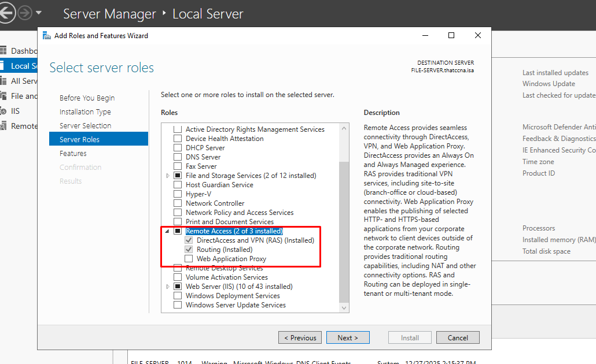
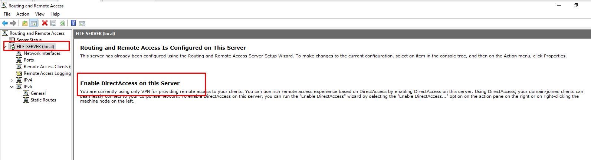
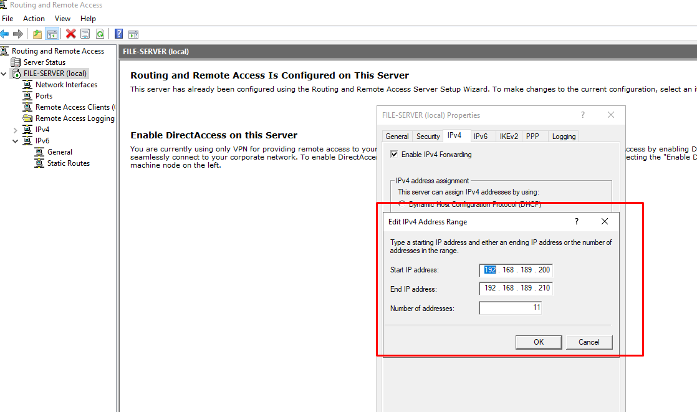
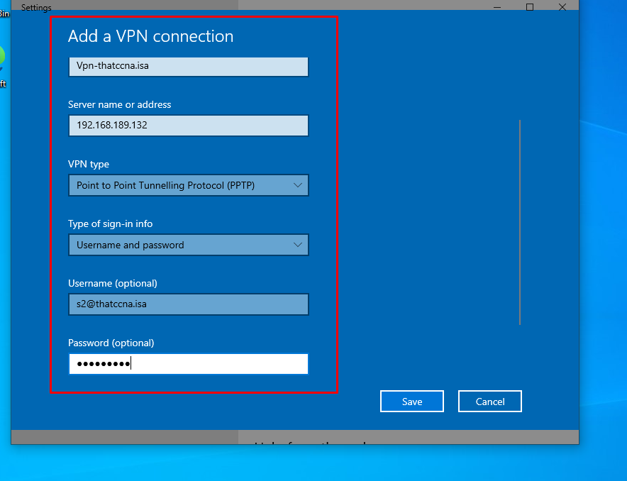
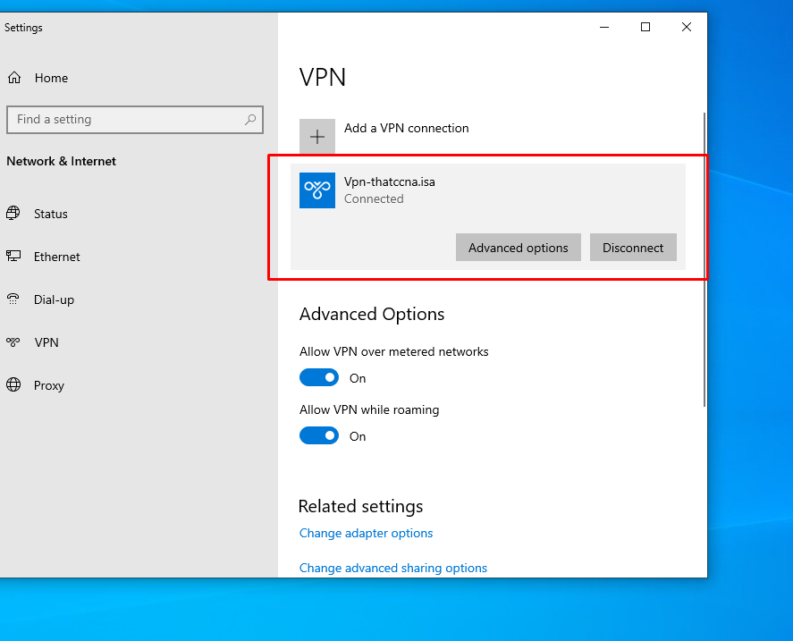
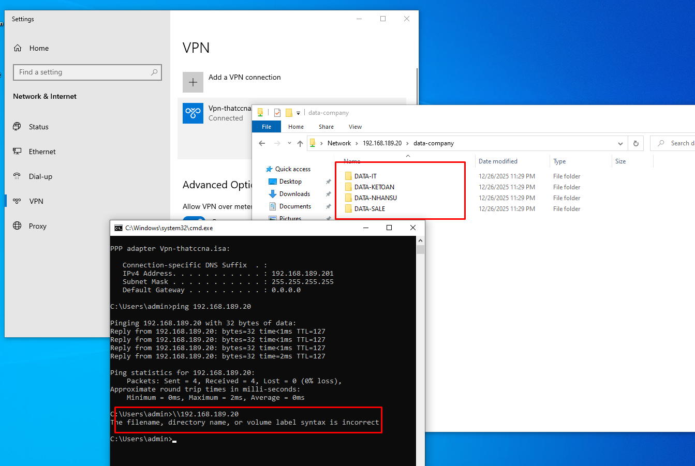

# VPN Remote Access – RRAS | thatccna.isa

## 🎯 Mục tiêu
Triển khai VPN Server cho user domain truy cập tài nguyên nội bộ từ ngoài mạng.

## 🧱 Mô hình
- Domain: thatccna.isa
- DC: 192.168.189.10
- VPN + File Server: 192.168.189.20
- VPN Client: External network (VMnet8)

## ⚙️ Các bước triển khai

### 1️⃣ Cài đặt RRAS

### 2️⃣ Enable VPN

### 3️⃣ Cấu hình IP Pool

### 4️⃣ Allow user Dial-in

### 5️⃣ Tạo VPN Client

### 6️⃣ VPN Connected

### 7️⃣ Truy cập LAN qua VPN

## ✅ Kết quả
User domain kết nối VPN thành công và truy cập được tài nguyên nội bộ.
